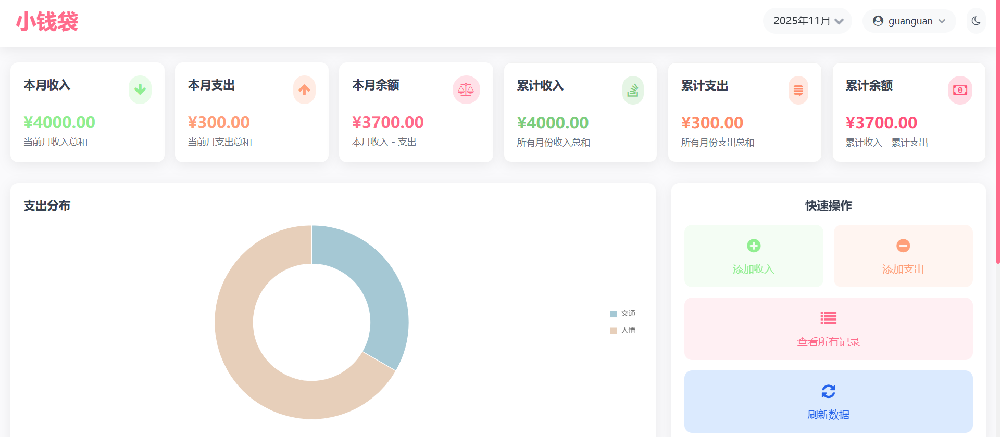

# 小钱袋 - 个人收支记录系统
给妹妹做的一个小demo,一个简单易用的个人收支记录管理系统，帮助您轻松管理日常财务。

- ✅ 用户注册和登录
- ✅ 收入和支出记录管理
- ✅ 数据统计和可视化
- ✅ 密码找回功能（通过邮件）
- ✅ 响应式设计，支持移动设备

## 技术栈

- **前端**: HTML5, CSS3, JavaScript, Tailwind CSS
- **后端**: Node.js, Express
- **数据库**: 内存数据库（演示用）
- **认证**: JWT (JSON Web Tokens)
- **邮件服务**: Nodemailer

## 快速开始

### 1. 安装依赖

```bash
cd backend
npm install
```

### 2. 配置环境变量

复制 `.env.example` 到 `.env` 并修改配置：

```bash
cp .env.example .env
```

### 3. 配置邮件服务

编辑 `.env` 文件，设置您的邮件服务信息：

```env
# QQ邮箱示例
EMAIL_USER=your-email@qq.com
EMAIL_PASS=your-authorization-code

# 网站域名
SITE_DOMAIN=http://localhost:5000
```

### 4. 启动服务器

```bash
npm start
```

或者使用开发模式：

```bash
npm run dev
```

### 5. 访问应用

打开浏览器本地访问 `http://localhost:5000`

## 项目结构

```
sister/
├── backend/                 # 后端代码
│   ├── server-auth.js      # 主服务器文件
│   ├── email-config.js     # 邮件配置
│   ├── package.json        # 项目依赖
│   └── .env.example        # 环境变量示例
├── front/                  # 前端代码
│   ├── index.html          # 主页面
│   ├── login.html          # 登录/注册页面
│   ├── reset-password.html # 重置密码页面
│   ├── config.js           # 前端配置
│   └── test_password_reset.html # 邮件测试页面
└── 部署指南.md             # 详细部署指南
```

## 功能说明

### 用户管理

- 用户注册：需要用户名、邮箱和密码
- 用户登录：使用用户名和密码登录
- 密码找回：通过注册邮箱找回密码

### 界面展示



### 收支记录

- 添加收入/支出记录
- 查看历史记录
- 删除记录
- 数据统计

### 邮件功能

- 密码重置邮件发送
- 支持多种邮箱服务（QQ、Gmail等）

## 注意事项

1. 本项目使用内存数据库，重启服务器后数据会丢失
2. 在生产环境中，请使用真实的数据库（如MySQL、MongoDB等）
3. 邮件功能需要正确配置SMTP服务器信息
4. 在生产环境中，请使用HTTPS协议

## 贡献

欢迎使用和贡献本项目！
如果你觉得有用，请给个star！
或者支付宝打赏五元

